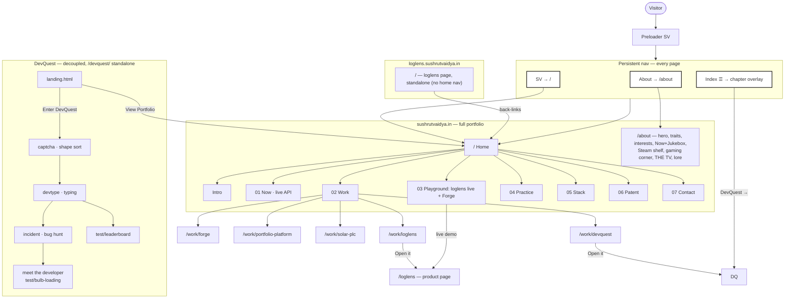

# Site navigation

How a visitor moves through the site. Two hosts, one build; DevQuest is decoupled
and served standalone at `/devquest/`.

## Flow

## Notes

- **loglens has three doors:** the live demo (Home › Playground), the case study
  (`/work/loglens`), and the product page (`/loglens` on the apex, or standalone on
  the `loglens.` subdomain).
- **DevQuest is decoupled:** reached via the Work card (`/work/devquest` → "Open it")
  and the Index overlay ("DevQuest →"), both landing on `/devquest/` — a self-contained
  static sub-app (landing → 3 challenges → developer reveal) with its own nav and a
  "View Portfolio" link back to the apex. It is not part of the SPA router.
- **Two hosts, one build:** the apex serves everything; `loglens.sushrutvaidya.in`
  renders the product page on its own, without the home nav.
